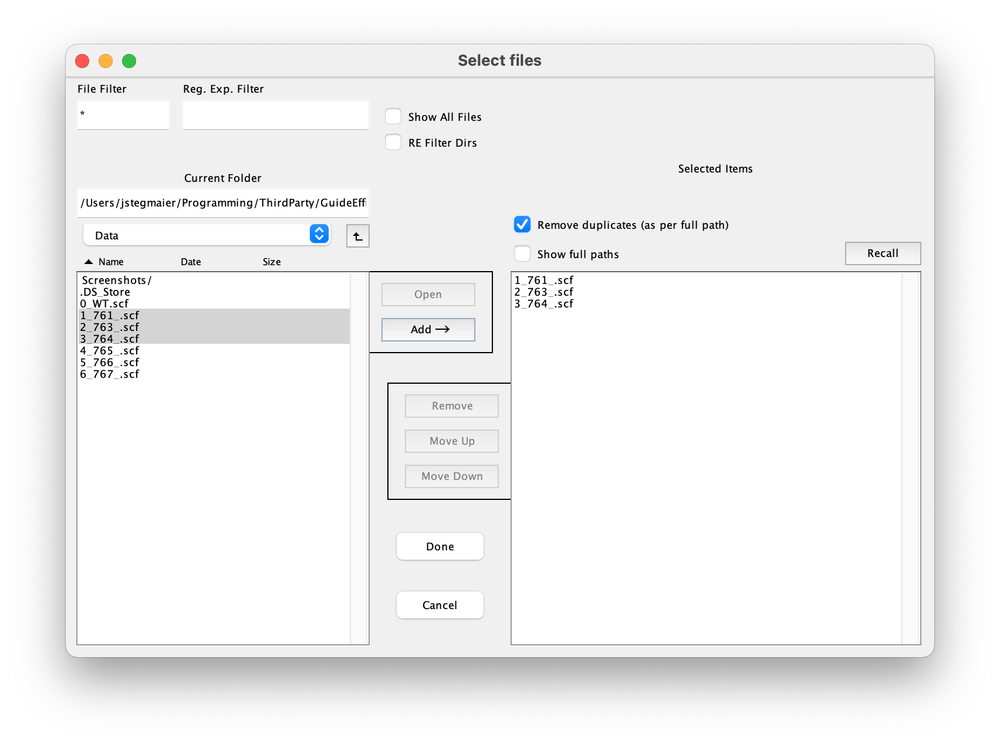
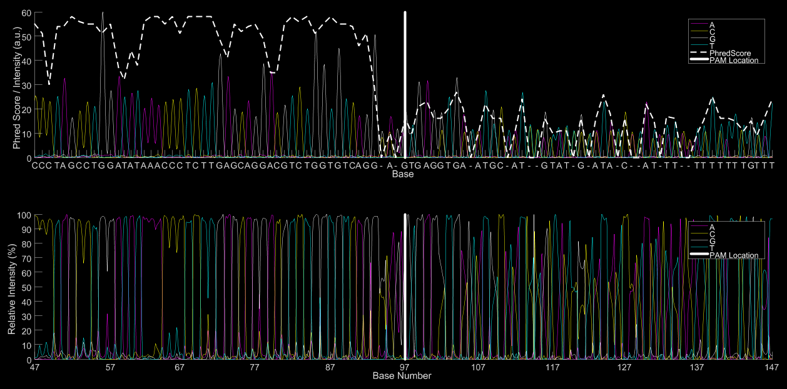

# Guide Efficiency Calculator

## Preliminaries
The software GuideEfficiencyCalculator is a standalone version of the software described in the following paper, which should be cited if you find this work useful:

	Etard, C., Joshi, S., Stegmaier, J., Mikut, R., & Strähle, U. "Tracking of Indels by DEcomposition is a Simple and Effective Method to Assess Efficiency of Guide RNAs in Zebrafish". Zebrafish, 14(6), 586-588. 2017.

The software is based on MATLAB and additionally requires the *Image Processing Toolbox* as well as the *Bioinformatics Toolbox*.

## Step 1: Upload Sequence Trace Files
Start the script called `GuideEfficiencyCalculatorLocal.m` by opening it in MATLAB and pressing the *Run* button on the top menu bar. The script will then open up a file upload dialog. Select the input files you want to process (they should appear on the right-hand list box) and press *Done* once all files are selected. 

Valid input files should be in the `*.scf` format. Please convert input files in different formats, *e.g.*, using software tools such as <a  href="http://biologylabs.utah.edu/jorgensen/wayned/ape/" target="_blank">ApE</a> or using the command-line tool <a href="http://sourceforge.net/projects/staden/files/io_lib/1.12.2/io_lib-1.12.2.tar.gz" target="_blank">io lib</a>.

## Step 2: Sequence Preview and Selection of the PAM Location
After all files you want to process are selected successfully, you can proceed with the preview generation and the selection of the PAM locations. The script will automatically generate a preview for the first image (see image below). Use the opened input dialog to enter the location of interest for the current sequence. The location of interest (`L`) should be either set to the PAM location or to a location close to the expected cutting location.

If the phred score of the read-out drops at a particular position, the location of the steepest quality drop can also be used. If needed, change the analysis radius (positive integer, default value `R=50`). The guide efficiency calculations are based on comparing the `R` bases before and after the location of interest `L`, respectively.

## Step 3: Process Data
Once the location of interest was set properly and the analysis radius was specified you can continue with the actual efficiency prediction by clicking *Ok*. This will automatically process the current sequence with the specified parameters for `R` and `L` yielding overview plots of the calculations. Note that this process may take a few seconds. 
The results of the analysis are stored as a subfolder called `results` that is created in the same folder as the input file was located in. 

If you selected multiple input files, the script will directly continue with the next sequence and you can repeat at *Step 2* until all files are properly processed.